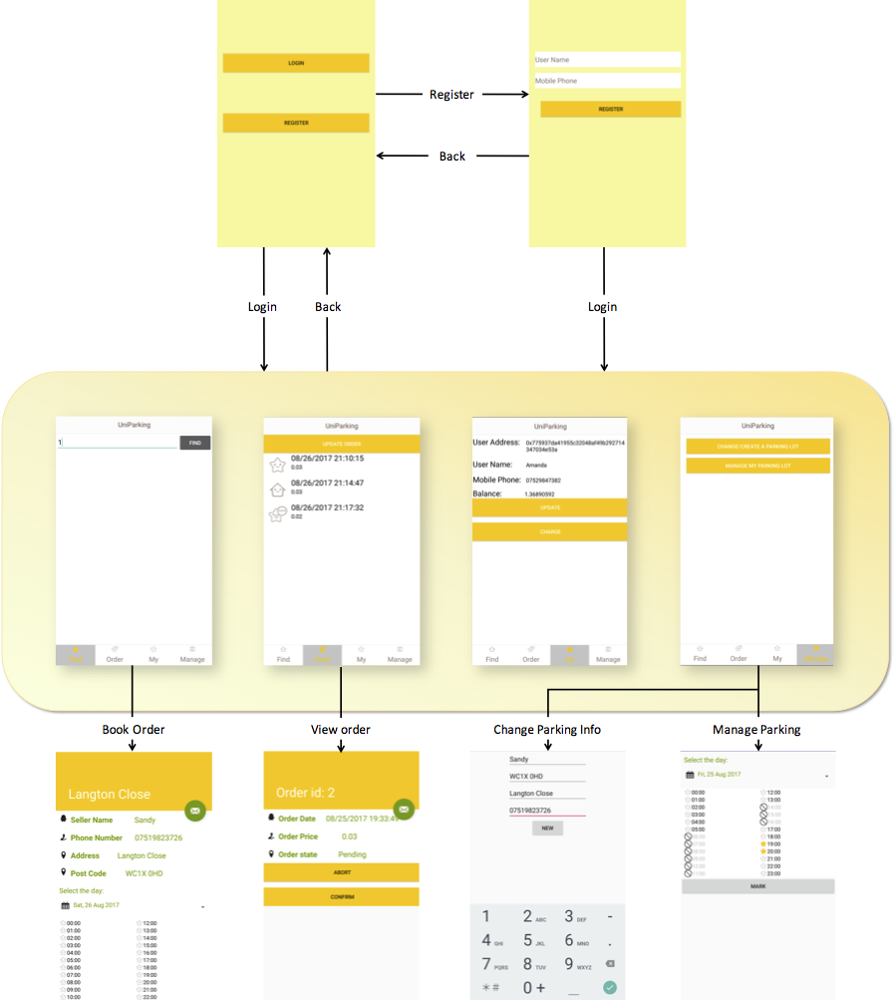
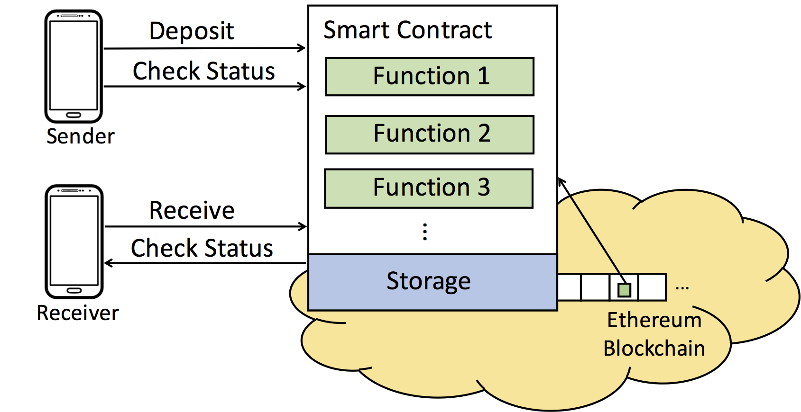
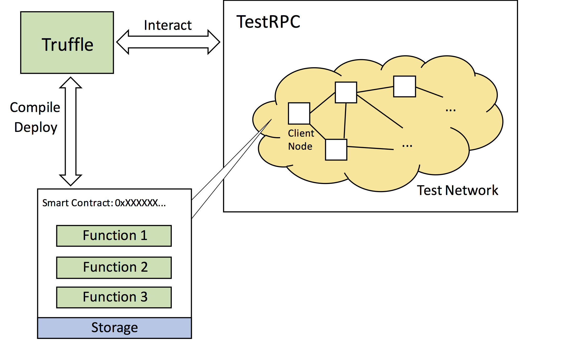

# Micropayment Android Application Based on Blockchain Smart Contracts

A pure decentralised application built on Ethereum blockchain. As the traditional structure of the servers exposed a large number of short comings in terms of computer capacity and security issues, there is a increasing demand for servers with higher integrity and availability. Due the nature of the blockchain where all running nodes work together to maintain and package the tranactions for the "server", the blockchain smart contract  technologies are better choices to realise a stronger server.

In this project, we put out a use case to evaluate the proposed work — **Parking Area Rental App**. This application is designed to increase the utilisation of private parking areas. It provides parking lot owners and those who are looking for parking spaces a platform to exchange resources. 

In the application, sellers rent out their parking lots while buyers book the parking lots. 

1. **Seller**: A user who owns a parking lot can create one account in the application, and rent out his parking area for hours. If the parking lot is used on his own, he will mark the time period that he needs as being occupied. 
2. **Buyer**: When a user would like to rent this parking area, he can select the time slot he wishes to stop and reserve the space. After using the parking lot, the user will confirm the order and pay the parking fee to the parking lot owner. 

An Interface overview shows as follows:

---

## Smart Contract

The smart contract is written in Solidity. The source code can be found [here](https://github.com/aurorasy/Web3j_project/blob/master/app/src/main/java/com/example/aurora/myweb3j/contract/ManageOrder.sol).

The whole system design is illustracted in the figure below. Ethereum, a programmable blockchain, is a suitable platform to run decentralised applications. In this micropayment system, the smart contract is deployed on the Ethereum blockchain. The contract consists of functions and rules and is deployed before this system is published. 

- **Smart contract**: The smart contract acts as a server that controls all behaviours and stores all relevant data in its storage. When mobile users send a request to the smart contract, some relevant pre-defined functions are called and executed. 
- **Mining nodes**: The mining nodes are responsible for computing the functions and package the activities. The user will then get a response from the contract if his identity is verified. 
- **User Example**: If the payment is based on a service such as online shopping, the sender of a payment may call functions to deposit money to the smart contract, and the receiver can get the amount of money from the contract when the sender confirms to receive the goods. In this case, the smart contract acts as a real “server” that is responsible for both communication and database management functions.

## How to Use

The diagram in the figure below clarifies how TestRPCand Truffle work when developing an Ethereum application.

- **TestRPC**: TestRPC v3.0.5 is used to simulate a full client behaviour. TestPRC includes most Remote Procedure Call (RPC) functions so that otherprogrammes can cause a procedure in the address of one full Ethereum node. This test Ethereum blockchain can also simulate the mining behaviour in a real blockchain. Also, by default, the Ethereum wallet will be allocated ten accounts with 100 ethers ineach account. These ethers are enough to pay transaction fees when developing smart contracts.
- **Truffle**: Truffle is used as a development environment to interact with the blockchain. With the interactive console integrated into Truffle, it is easy to build, compile and deploy a contract to the blockchain. 

---

#### Steps to use the application:

1. Install TestRPC  `npm install -g ethereumjs-testrpc`
2. Run `testrpc testrpc -b 2`(specify the mining interval at two seconds), ten accounts will be allocated with 100 ethers in each account. Further details please refer to [here](https://github.com/ethereumjs/testrpc).
3. Install Truffle `npm install -g truffle`
4. Run truffle init to initiate a new smart contract, and create a new `.sol` file in `/contract`.  
5. Paste the contract code to this `.sol` file, and modify the migration files (please refer to the truffle documents [here](http://truffle.readthedocs.io/en/beta/)).
6. Run `truffle compile` and `truffle migrate` after start the testrpc network. 
7. Use `truffle console` to interact with the smart contract. Get the contract address and abi file from this console. For example, to get the address, type `ManageOrder.deployed().then(function(instance){return instance.address;}).then(function(result){console.log(JSON.stringify(result));})`
8. Modify the IP address and contract address [in this file](https://github.com/aurorasy/Web3j_project/blob/master/app/src/main/java/com/example/aurora/myweb3j/util/Web3jConstants.java). 
9. Start the Android application and enjoy the demo.

## Contact Detail

Yuan Shen, aurorasy@126.com, aurora.shenyuan@gmail.com

Welcome all discussions on Blockchain and Smart Contract!